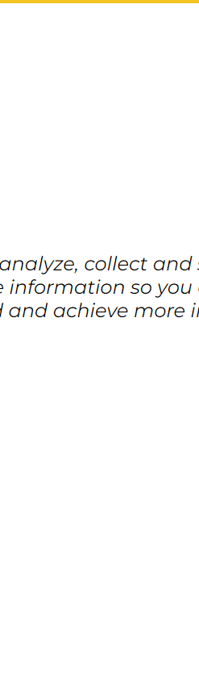

## Demonstrasjon

## Responsive design

## Link

https://anderskoo.github.io/learn/#/

## Beskrivelse 

I dette prosjektet eksperimenterer jeg med router og link komponentene i react.js(3 sider).
Jeg har også lekt litt med biblioteket swup.

## Kilder 

Color theme 
https://colorhunt.co/palette/189775 
React Navbar Tutorial - Beginner React JS Project 
https://www.youtube.com/watch?v=fL8cFqhTHwA 
Create a Multi Page Web App With React 
https://www.youtube.com/watch?v=xMNhDf5-hvk&list=LL&index=1 
React Footer Tutorial Using Styled Components & Compound Components - Beginner React JS Project 
https://www.youtube.com/watch?v=SdWJj1LSQPE&list=LL&index=1 
Cool Link Hover Effect | HTML & CSS 
https://www.youtube.com/watch?v=IYTBAQRBsw0 
Handshake 
https://www.hiclipart.com/free-transparent-background-png-clipart-dawrh 
Partner logo 
https://seekvectorlogo.com/ 
Complete, flexible, extensible and easy to use page transition library for your web. 
https://swup.js.org/ 
